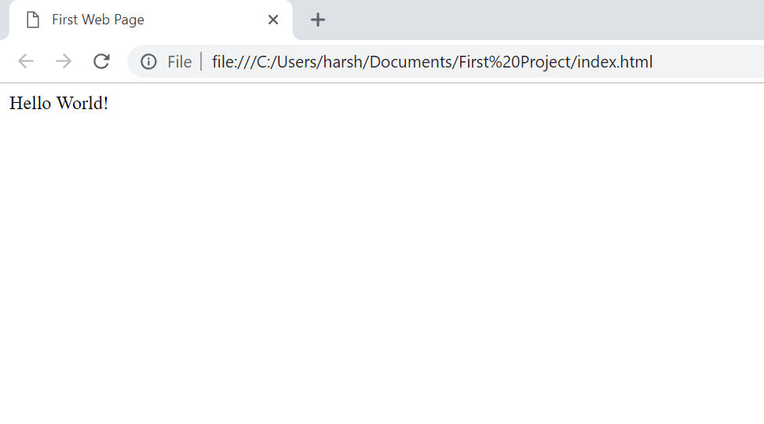
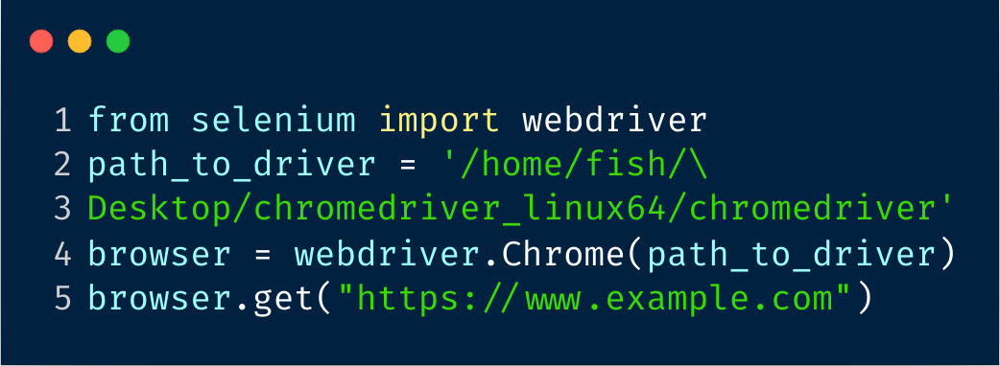

# A simple web scraping workflow for salon

***

## Overview

This project is simply a introduction to web scraping for the sake of laymen, as it focuses on the workflow and ideas behind it.

**web scraping, in essence, is to crtl + c selectively. **(But I'm receptive to disagreement over this)

## Prerequisites | 要求

- ### Tools | 工具

    - ### Programming language: | 编程语言

        - #### beginner: Python (simple syntax, high-level code for small project) | 代码简洁，可读性强 (小项目)

        - #### advanced: Javascript (browser support natively) | 浏览器原生支持

    - ### GUI: | 可交互工具
        - #### Chrome Extension

            - #### spider 
    
            - #### web scraper 
    
***
## 1. Request, Response, and Parse | 请求=>响应=>解析

- ### You ready to order? | 点餐

## 

- ### A simple example of HTML | HTML模板 

### 

- ### From user's perspective  | 浏览器让你看到的:

- ### parse | 解析

    #### Analogy | 类比

- ### Or automate it! | 自动化

***

## 2. What's next for your dataset? | 数据集处理
- ### Machine learning | 机器学习
    - ### NLP |  自然语言处理
        - ### Text Classification | 文本分类 
- ### Backend | 后端 
  - ### Database | 数据库

# The point is to suit your needs | 面向需求学习