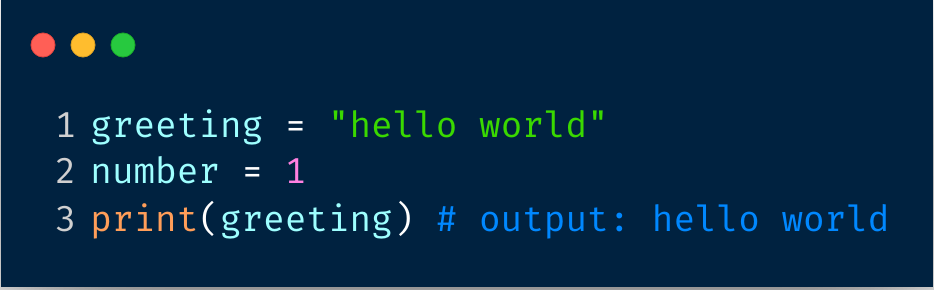
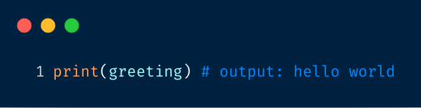
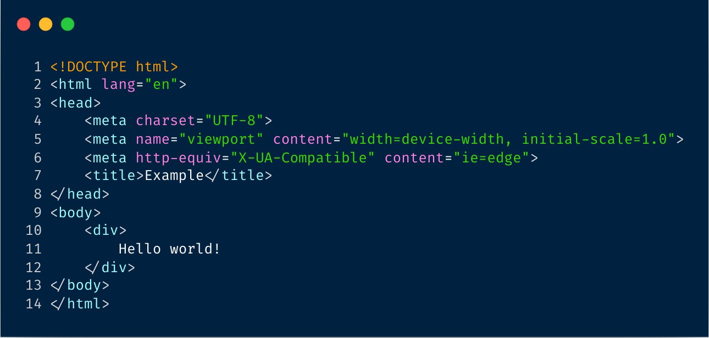
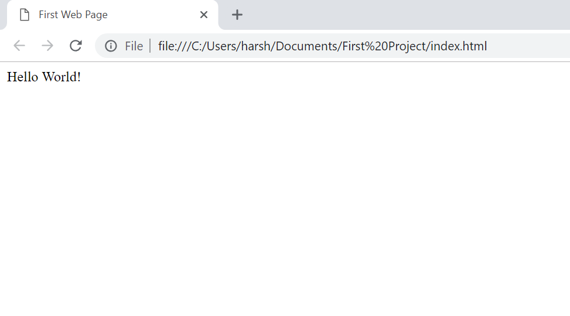
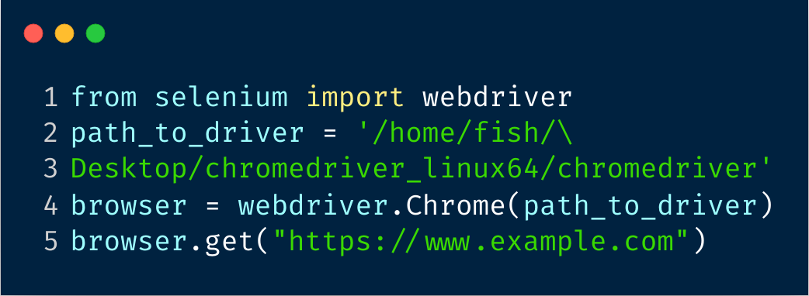
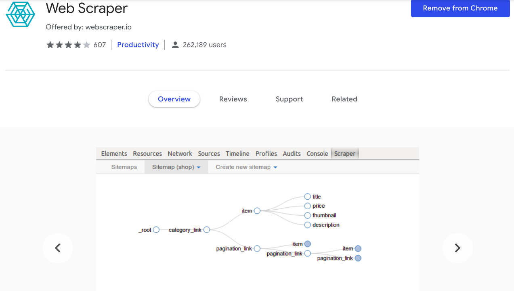

# A simple web scraping workflow for salon

***

## Overview

This project is simply a introduction to web scraping for the sake of laymen, as it focuses on the workflow and ideas behind it.

## Prerequisites | 要求

- ### Variable | 变量

  

- ### Function | 函数

  			

- ### Library | 库

  

***

## 1. Http Request | 网络请求

### 	A simple example of HTML | HTML模板 

### 

### browser  | 浏览器让你看到的:

## Bonus: or simulate it! | 自动化

## 2. parse | 解析

#### Analogy | 类比

### For Non-developer | 非编程工具

## 3. What's next for your dataset? | 数据集处理

- ### NLP/Cleaning dirty data |  自然语言处理/如数据清洗

- ### Machine learning | 如文本分类

- ### Backend | 后端 

  - ### Database | 数据库

## The point is to suit your needs | 面向需求学习